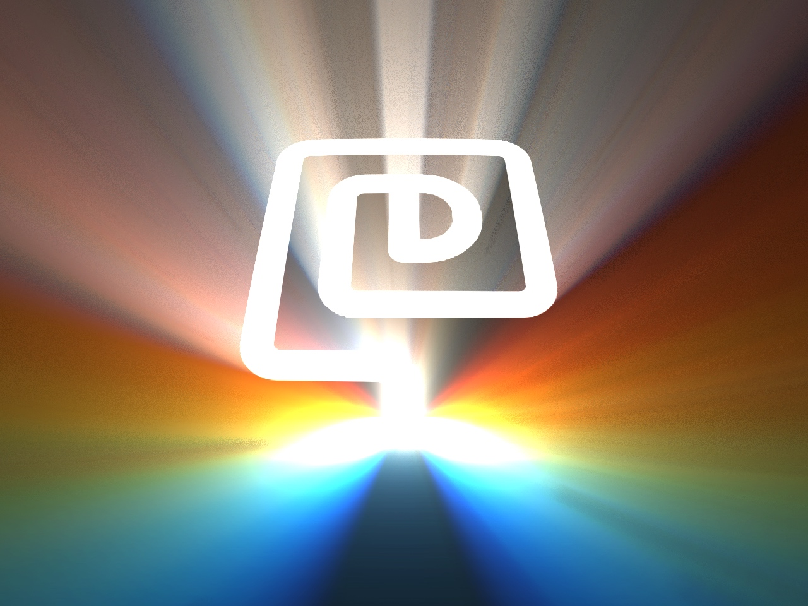

# Raycast

A WebGL2 raytracer for light rays through a stencil in a foggy environment.

Configured to render the [davidje13.com](https://davidje13.com/) logo.

[](https://davidje13.github.io/Raycast/#{"resolution":2,"lightQuality":70,"time":0,"stencil":{"frame":0.90279314159292,"trace":0.25},"dust":{"opacity":0.3,"reflectivity":15},"lights":[{"pos":{"x":0,"y":-0.66924778761062,"z":-2.2678990590744057},"col":{"r":7.76337372688978,"g":0.342830802628411,"b":0}},{"pos":{"x":0,"y":-0.66924778761062,"z":-2.1858691274694744},"col":{"r":7.64127610602126,"g":2.14525715266838,"b":0}},{"pos":{"x":0,"y":-0.66924778761062,"z":-2.1086328688068723},"col":{"r":6.29820227646759,"g":3.61076357598732,"b":0}},{"pos":{"x":0,"y":-0.66924778761062,"z":-2.0357551669189085},"col":{"r":3.73415223822876,"g":4.49006742997868,"b":0}},{"pos":{"x":0,"y":-0.66924778761062,"z":-1.9668517997855208},"col":{"r":0.524002289560712,"g":4.78316871464247,"b":0.524002289560712}},{"pos":{"x":0,"y":-0.66924778761062,"z":-1.9015822015875694},"col":{"r":0,"g":4.49006742997868,"b":3.73415223822877}},{"pos":{"x":0,"y":-0.66924778761062,"z":-1.83964342564615},"col":{"r":0,"g":3.61076357598732,"b":6.29820227646758}},{"pos":{"x":0,"y":-0.66924778761062,"z":-1.7807650820426582},"col":{"r":0,"g":2.14525715266838,"b":7.64127610602126}},{"pos":{"x":0,"y":-0.66924778761062,"z":-1.7247050711340774},"col":{"r":0,"g":0.342830802628411,"b":7.76337372688978}}],"fog":0.35,"grid":false,"view":{"fov":0.8726646259971648,"eyeSeparation":0,"camera":{"x":0,"y":1.56941371681416,"z":2.10418971238938},"focus":{"x":0,"y":-0.0373340707964602,"z":0},"up":{"x":0,"y":0,"z":1}}})

[](https://davidje13.github.io/Raycast/#{"resolution":2,"lightQuality":70,"time":0,"stencil":{"frame":1,"trace":0.25},"dust":{"opacity":0.3,"reflectivity":15},"lights":[{"pos":{"x":0,"y":-0.166620575221239,"z":-2.301885537113461},"col":{"r":7.47599451303155,"g":0.330140128443232,"b":0}},{"pos":{"x":0,"y":-0.166620575221239,"z":-2.408908943741008},"col":{"r":7.35841661767588,"g":2.0658455030756,"b":0}},{"pos":{"x":0,"y":-0.166620575221239,"z":-2.5247094101336156},"col":{"r":6.06505976876347,"g":3.47710282044479,"b":0}},{"pos":{"x":0,"y":-0.166620575221239,"z":-2.6504829388550677},"col":{"r":3.59592396629434,"g":4.3238572108663,"b":0}},{"pos":{"x":0,"y":-0.166620575221239,"z":-2.787652501418724},"col":{"r":0.504605134234764,"g":4.60610867434014,"b":0.504605134234764}},{"pos":{"x":0,"y":-0.166620575221239,"z":-2.937924598100105},"col":{"r":0,"g":4.3238572108663,"b":3.59592396629434}},{"pos":{"x":0,"y":-0.166620575221239,"z":-3.103363617423807},"col":{"r":0,"g":3.47710282044479,"b":6.06505976876347}},{"pos":{"x":0,"y":-0.166620575221239,"z":-3.286490892398217},"col":{"r":0,"g":2.0658455030756,"b":7.35841661767588}},{"pos":{"x":0,"y":-0.166620575221239,"z":-3.490418583830157},"col":{"r":0,"g":0.330140128443232,"b":7.47599451303155}}],"fog":0.35,"grid":false,"view":{"fov":0.6153299217104456,"eyeSeparation":0,"camera":{"x":0,"y":0.00691371681416,"z":4.64567201327434},"focus":{"x":0,"y":-0.0027654867256636,"z":0},"up":{"x":0,"y":-1,"z":1}}})
